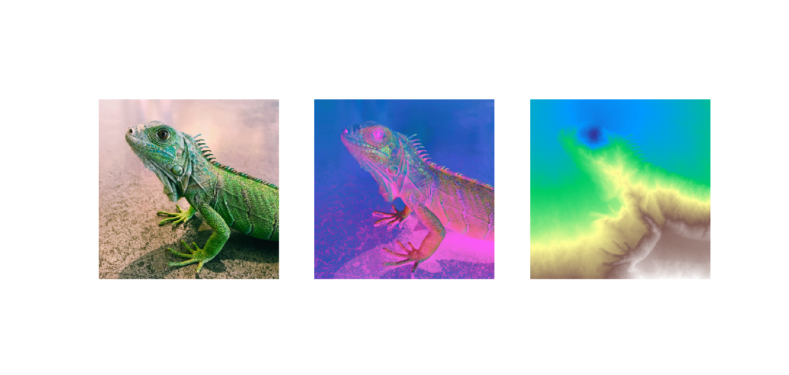

# geodesic_transform
Geodesic Transform based on Yatziv, Bartesaghi, and Sapiro's paper.

A Distance Transform is finds the minimum distance to a set of seeds, S, via solving a partial differential equation (Eikonal equation). Using an untidy priority queue, this can be solved in O(n).

A Geodesic Distance Transform solves the minimum distance to a set of seeds, but under the guise of 'walking along' the surface of a gray-scale (color) image.

In this example, I put a seed in the lizard's eye, and doing a whitening on the image's colors (middle image), and finally calculate the transform.

The code for the geodesic transform is in pure C++.
